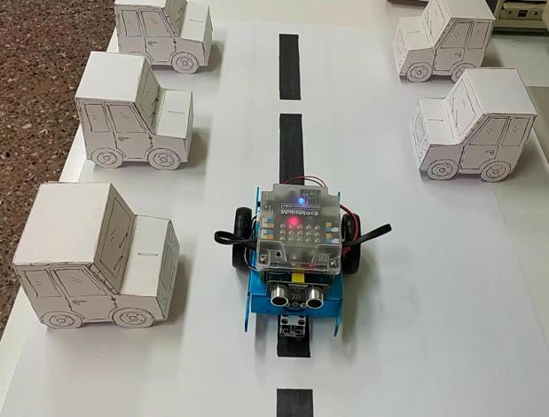

# robotics
Έργο για τον διαγωνισμό ρομποτικής

Στόχος μας είναι να χρησιμοποιήσουμε το ρομπότ Mbot για να αναπαραστήσομε την κίνηση ενός αυτόνομου οχήματος που εισέρχεται σε ένα χώρο στάθμευσης, εντοπίζει την πρώτη ελεύθερη θέση και παρκάρει.

Τα αυτόνομα αυτοκίνητα ή αυτοκίνητα χωρίς οδηγό, είναι οχήματα που αντιλαμβάνονται το περιβάλλον τους και κινούνται με ελάχιστη ή καθόλου ανθρώπινη παρέμβαση. 
Συνδυάζουν διάφορους αισθητήρες για να αντιληφθούν το περιβάλλον τους, όπως ραντάρ, Lidar, σόναρ, GPS, αισθητήρες κίνησης (αξελερόμετρο) και περιστροφής (γυροσκόπιο). Τα προηγμένα συστήματα ελέγχου ερμηνεύουν τις πληροφορίες από τους αισθητήρες για τον εντοπισμό των κατάλληλων διαδρομών πλοήγησης, καθώς και των εμποδίων και της σχετικής σήμανσης. Περισσότερες πληροφορίες:

[αυτόνομο αυτοκίνητο](Docs/autonomousCar.odt)

Το ρομποτάκι MBOT, βασισμένο στον Arduino Uno, διαθέτει αισθητήρα παρακολούθησης γραμμής και αισθητήρα απόστασης με τον οποίο μπορεί να αναγνωρίζει εμπόδια μπροστά του. Αυτοί είναι οι πιο βασικοί αισθητήρες για το έργο ώστε να μπορεί το ρομποτάκι να κινείται σε μια λωρίδα στο χώρο στάθμευσης και να αναγνωρίζει αν μια θέση στάθμευσης είναι κατειλημμένη ή όχι. Περισσότερα για το ρομποτάκι: 
[mbot](Docs/Mbot.odt)

Επιπλέον υλικά που χρειαστήκσμε είναι ένα χαρτόνι με σχέδιο για το χώρο στάθμευσης και αυτοκίνητα για τις κατειλημμένες θέσεις.  

Ο κώδικας με την τεκμηρίωση βρίσκονται στο φάκελο 
[κώδικας](Code).

Παρακάτω υπάρχουν φωτογραφίες και βίντεο με παρουσίαση της κίνησης του ρομπότ στο πάρκιν και τους μαθητές να εξηγούν τη λύση που έδωσαν: 
[φωτογραφίες](Video) και [βίντεο](Video/youtube.odt).

Συμμετείχαν οι μαθητές της ΣΤ΄τάξης Γαλανός Δημήτρης, Κλαψιανού Ασημίνα, Κορνέζου Μαρία Ελένη και η καθηγήτρια Πληροφορικής Θεοδωρίδου Δώρα.

